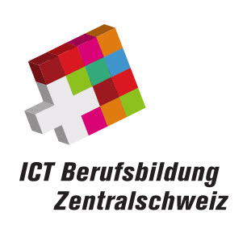

# Firmenportrait

## Firmenvorstellung 

Der Verein ICT-Berufsbildung Zentralschweiz (ICT-BZ) ist im Sinne des Bundesgesetzes über die Berufsbildung (BBG) eine regionale Organisation der Arbeitswelt (OdA) für das stark wachsende Berufsfeld der Informations- und Kommunikationstechnologie (ICT). Als solche verfolgt ICT-BZ die Verwirklichung der Ziele des BBG durch:

- Förderung der Grundbildung von Lernenden.
- Organisation u. Durchführung von Überbetrieblichen Kursen (ÜK).
- Koordination der Lernorte (Lehrbetrieb, Schule, ÜK-Zentrum).
- Mitarbeit bei Organisation u. Durchführung vorgegebener Qualifikationsverfahren.
- Betreiben von Berufs- u. Lehrstellenmarketing.
- Beratung der Ausbildungsbetriebe.

ICT-BZ ist nicht gewinnorientiert und verfolgt ausschliesslich ideelle Zwecke. Eine wirtschaftliche Zielsetzung ist ausgeschlossen. 

ICT-BZ ist dem nationalen Dachverband ICT-Berufsbildung Schweiz angeschlossen und teilt dessen Vision, der branchenübergreifend führende Verband für das Thema ICT-Kompetenzen in der Berufsbildung zu sein.

Die Geschäftsstelle in Adligenswil beschäftigt 6 Mitarbeitende und 2 Lernende.

## Geschichte 

[comment]: todo
