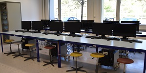
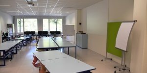

# Ausbildungszentrum 

ICT-Berufsbildung Zentralschweiz organisiert für die Informatik- und Mediamatik-Lernenden die überbetrieblichen Kurse (ÜK). Diese finden im ICT-BZ Ausbildungszentrum in Adligenswil statt. Auf Anfrage können Sie unsere Kursräume auch für Schulungen oder andere Veranstaltungen mieten. 

## Ausstattung

### Moderne IT

- Beamer
- Printer
- Aktuellste Software 

### Optimale Ausbildungsbedingungen 

- 4 Kursräume mit mindestens 12 bis 14 Arbeitsplätze pro Kursraum
- Schulungs-Bereich und Labor-Bereich für effizienten Kursbetrieb

[comment]: todo Infrastruktur ergänzen